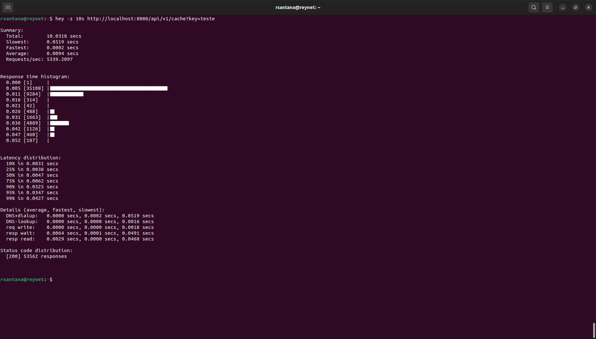
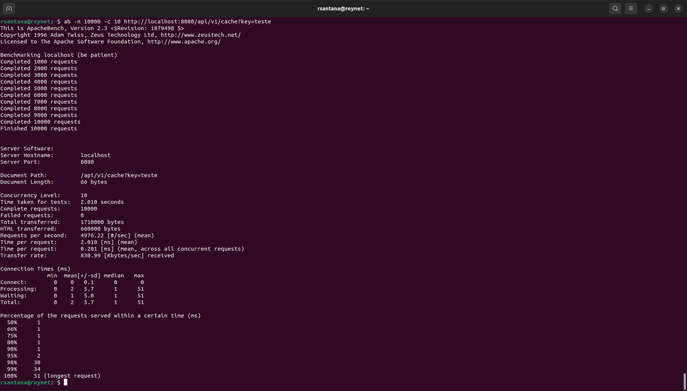

# Spring Boot Redis Example

Este é um exemplo simples de integração do Spring Boot com o Redis, demonstrando como configurar e usar o Redis em um aplicativo Spring Boot.

## Funcionalidades

- Configuração do Spring Boot para integrar com o Redis.
- Exemplo de armazenamento e recuperação de dados em cache usando Redis.
- Demonstração de tratamento de exceções ao usar o Redis.

## Pré-requisitos

- JDK 21 ou superior
- Maven
- Redis Server (pode ser executado localmente ou em um servidor remoto)

## Configuração

- Clone o repositório: `git clone https://github.com/zsantana/spring-boot-redis.git`
- Navegue até o diretório do projeto: `cd spring-boot-redis`
- Execute o aplicativo Spring Boot: `mvn spring-boot:run`

O aplicativo estará disponível em `http://localhost:8080`.

## Como usar

1. Acesse `http://localhost:8080/put?key=test&value=testValue` para armazenar um valor no cache do Redis.
2. Acesse `http://localhost:8080/get?key=test` para recuperar o valor armazenado no cache do Redis.
3. A aplicação inclui tratamento de exceções para lidar com possíveis erros ao se conectar ou interagir com o Redis.

## Contribuindo

Contribuições são bem-vindas! Sinta-se à vontade para abrir problemas ou enviar solicitações de recebimento de alterações.

## Licença

Este projeto está licenciado sob a Licença MIT - veja o arquivo [LICENSE](LICENSE) para detalhes.

## Performance

1. Usando HEY: hey -z 10s http://localhost:8080/api/v1/cache?key=teste

2. Apache Bench
